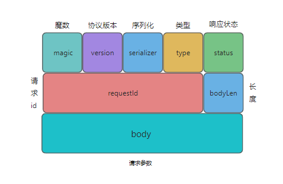
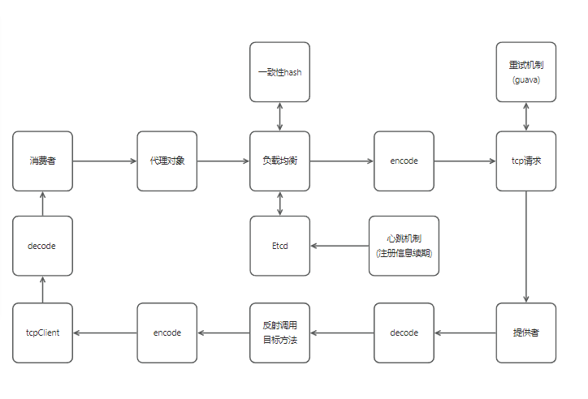

# trible-rpc项目

- 技术栈: JDK8(动态代理+反射)、Etcd、Vert.x、Springboot、guava、spi机制
- 适用性: 与 Dubbo 流程调用一致

## Architecture

## Feature

- 自动服务注册和发现
- 支持负载均衡(一致性hash算法)
- 支持服务重试
- 注册中心采用Etcd实现
- 支持多种序列化机制(JDK,KRYO,HESSIAN)

## Packet structure

- 自定义协议结构(类Dubbo)

## 调用流程

## 示例项目

### 核心模块:

- trible-rpc-core
- trible-springboot-starter
- trible-provider-starter
- trible-consumer-starter
- example-common

### 参考文档

- 下载核心模块 救赎之道就在其中
配置好Etcd注册中心后一键启动消费者和提供者
- trible-provider-starter
- trible-consumer-starter
